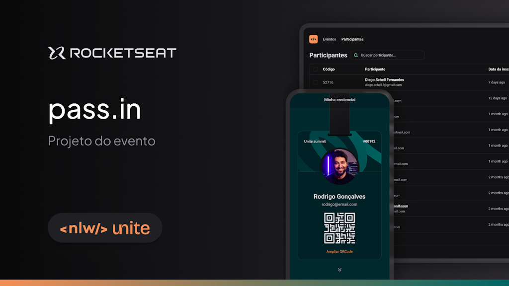

# 🎟️ pass.in

Este projeto é uma API back-end em C#, desenvolvida durante o **NLW Unite** da [Rocketseat][rocketseat-linkedin-url]. A API, chamada **pass.in**, foi criada para gerenciar participantes em eventos. Ela permite que organizadores cadastrem eventos e disponibilizem páginas públicas de inscrição. Os participantes podem então emitir uma credencial para check-in no dia do evento.

<!-- Confira o deploy da API 🎟️ [pass.in &#8226; API][deploy]. -->

## 🚀 Começando

* **[Especificações da API](#especificações-da-api)**
* **[Tecnologias Utilizadas](#%EF%B8%8F-tecnologias-utilizadas)**
* **[Instalação de Pacotes](#-instalação-de-pacotes)**
* **[Banco de Dados](#%EF%B8%8F-banco-de-dados)**

## 🌟 Especificações da API

Veja a [Documentação Swagger da API ][documentation-url].

### Regras de negócio
----

- ✅ O participante só pode se inscrever em um evento uma única vez;
- ✅ O participante só pode se inscrever em eventos com vagas disponíveis;
- ✅ O participante só pode realizar check-in em um evento uma única vez.

### Requisitos
----

#### Funcionais

- ✅ O organizador deve poder cadastrar um novo evento;
- ✅ O organizador deve poder visualizar dados de um evento;
- ✅ O organizador deve poder visualizar a lista de participantes;
- ✅ O participante deve poder se inscrever no evento;
- ✅ O participante deve poder realizar check-in no evento;
- 🟥  O participante deve poder visualizar seu crachá de inscrição.

#### Não funcionais

- 🟥 O check-in no evento será realizado através de um QRCode.


## 🛠️ Tecnologias Utilizadas

* 🖥️ [C#](https://learn.microsoft.com/pt-br/dotnet/csharp/): Linguagem de programação versátil e poderosa, amplamente utilizada para desenvolvimento de software;
* 🌐 [ASP.Net Core](https://learn.microsoft.com/pt-br/dotnet/api/?view=aspnetcore-8.0): Framework de desenvolvimento web open-source da Microsoft, multiplataforma e de alto desempenho, utilizado para criar aplicativos web modernos e escaláveis;
* 🔄 [Entity Framework](https://learn.microsoft.com/en-us/ef/): Framework de mapeamento objeto-relacional para .NET que simplifica o acesso e manipulação de dados em bancos de dados relacionais;
* 🛢️ [SQLite](https://www.sqlite.org/): Banco de dados relacional leve, ideal para aplicativos móveis e sistemas embarcados. Não requer um servidor separado e suporta SQL padrão.

## 📋 Pré-requisitos
Necessita de .Net 8 para rodar. Verifique a versão do .Net instalada na sua máquina com o seguinte comando:

```bash
dotnet --version
```

Caso encontre dificuldades, experimente atualizar o Visual Studio para a versão mais recente.

### 📦 Instalação de Pacotes
----
#### PassIn.API
* Microsoft.AspNetCore.Mvc;

#### PassIn.Infrastructure
* Microsoft.EntityFrameworkCore.Sqlite;
* Microsoft.EntityFrameworkCore.

## 🛢️ Banco de Dados

```bash
CREATE TABLE "events" (
    "id" TEXT NOT NULL PRIMARY KEY,
    "title" TEXT NOT NULL,
    "details" TEXT,
    "slug" TEXT NOT NULL,
    "maximum_attendees" INTEGER
);

CREATE TABLE "attendees" (
    "id" TEXT NOT NULL PRIMARY KEY,
    "name" TEXT NOT NULL,
    "email" TEXT NOT NULL,
    "event_id" TEXT NOT NULL,
    "created_at" DATETIME NOT NULL DEFAULT CURRENT_TIMESTAMP,
    CONSTRAINT "attendees_event_id_fkey" FOREIGN KEY ("event_id") REFERENCES "events" ("id") ON DELETE RESTRICT ON UPDATE CASCADE
);

CREATE TABLE "check_ins" (
    "id" INTEGER NOT NULL PRIMARY KEY AUTOINCREMENT,
    "created_at" DATETIME NOT NULL DEFAULT CURRENT_TIMESTAMP,
    "attendeeId" TEXT NOT NULL,
    CONSTRAINT "check_ins_attendeeId_fkey" FOREIGN KEY ("attendeeId") REFERENCES "attendees" ("id") ON DELETE RESTRICT ON UPDATE CASCADE
);

CREATE UNIQUE INDEX "events_slug_key" ON "events"("slug");
CREATE UNIQUE INDEX "attendees_event_id_email_key" ON "attendees"("event_id", "email");
CREATE UNIQUE INDEX "check_ins_attendeeId_key" ON "check_ins"("attendeeId");
```

## ✒️ Autores
* **Rocketseat** - *NLW Unite C#* - [Rocketseat Education][rocketseat-git-url]

## 🖇️ Contribuição

* **Wellington Henrique** - *Implementação em aula* - [LinkedIn][linkedin-url]

## Banner do Projeto


Se você encontrar problemas, bugs ou tiver sugestões para melhorar este projeto, sinta-se à vontade para abrir uma issue ou enviar um pull request.

## 📜 Licença
MIT

## 🙏 Expressões de gratidão

* Agradeço a [Rocketseat][rocketseat-linkedin-url] por compartilhar este conhecimento!🫂.

----

<!-- 🎟️ [pass.in &#8226; API][deploy] com ❤️ por [Wellington Henrique][linkedin-url] 😊 -->

[linkedin-url]: https://www.linkedin.com/in/wellingtonhlc/
[documentation-url]: https://wellington-henrique.github.io/pass-in-api-csharp/
[rocketseat-linkedin-url]: https://www.linkedin.com/school/rocketseat/
[rocketseat-git-url]: https://github.com/rocketseat-education/nlw-expert-c-sharp